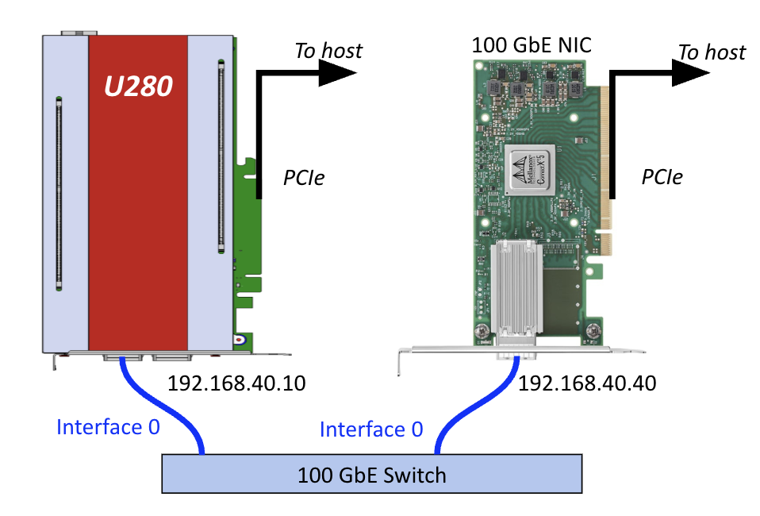
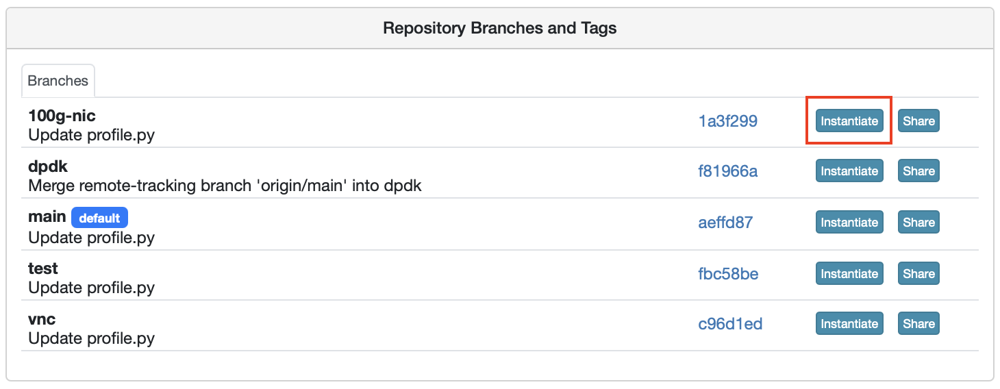
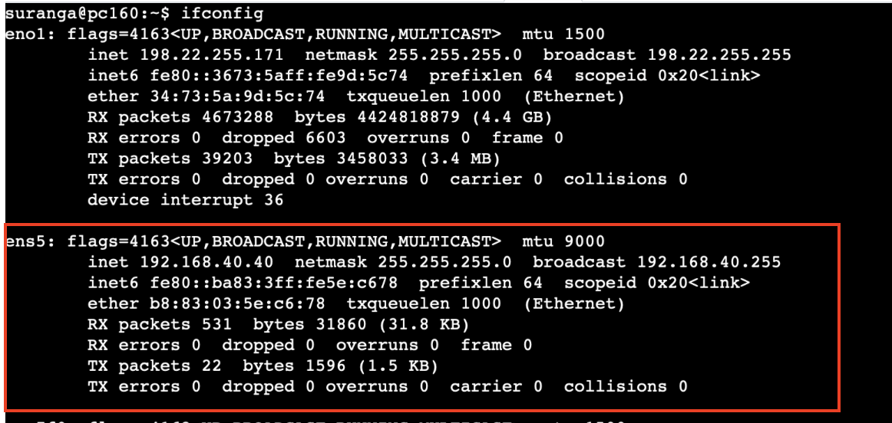
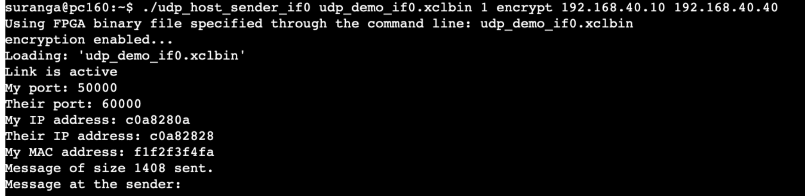
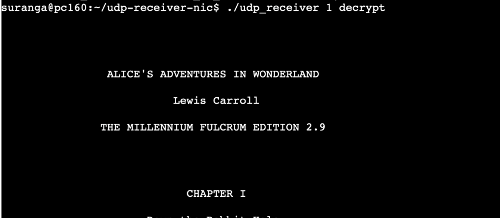

# FPGA to NIC Communication: U280 as Sender and 100 GbE NIC as Receiver

## `udp_receiver.c`: Receiver for FPGA generated UDP packets

This repository includes host code for capturing UDP packets sent from an FPGA over the network. You can use either a 40 GbE NIC or a 100 GbE NIC (available on some OCT nodes) for the experiment.

## Prerequisites

Make sure you've got the required FPGA bitstream and the sender host executable ready before setting up the experiment. You'll find the UDP sender in the [udp-network-demo](https://github.com/OCT-FPGA/udp-network-demo) repository. Just follow the instructions provided in the repository to generate the necessary bitstream and host executables.



## Instructions for Usage

### Clone the Repository

```bash
git clone https://github.com/OCT-FPGA/udp-receiver-nic
```

### Compiling the Receiver

Install the following dependencies if required.

```bash
libssl-dev
libpcap-dev
```

Then you can run the following command to build the receiver executable.

```bash
make
```

### Deployment

You can use either a 40 GbE NIC or a 100 GbE NIC. All OCT nodes come with 40 GbE NICs, but only nodes pc160 through pc163 have 100 GbE NICs. If you want to use a 40 GbE NIC as the receiver, use the `oct-u280` CloudLab profile. If you want to use a 100 GbE NIC as the receiver, still use the oct-u280 profile, but switch to the 100g-nic branch.


For this experiment, having one node is enough. This is because nodes in this profile come with both an FPGA and a NIC. However, if you want the sender and receiver on different nodes, you should use two nodes when creating the experiment.

Once the node has booted up, run ifconfig to verify whether the NIC interface is active. 


If it isn’t showing up, you should configure the IP address manually.

```bash
sudo ifconfig ens5 192.168.40.40 netmask 255.255.255.0 up
```

Run the receiver program on the receiving node:

```bash
$ ./receiver <number_of_packets> <decrypt|no-decrypt> 
```
Finally, run the sender program on the sending (FPGA) node:

```bash
$ ./udp_host_sender_if0 udp_demo_if0.xclbin <number_of_packets> <encrypt|no-encrypt> <sender IP> <receiver IP> <IP gateway>
```


