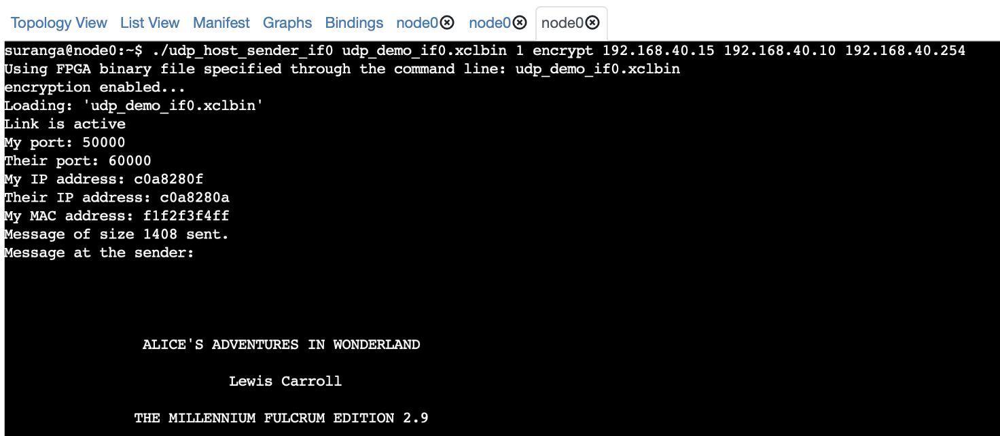
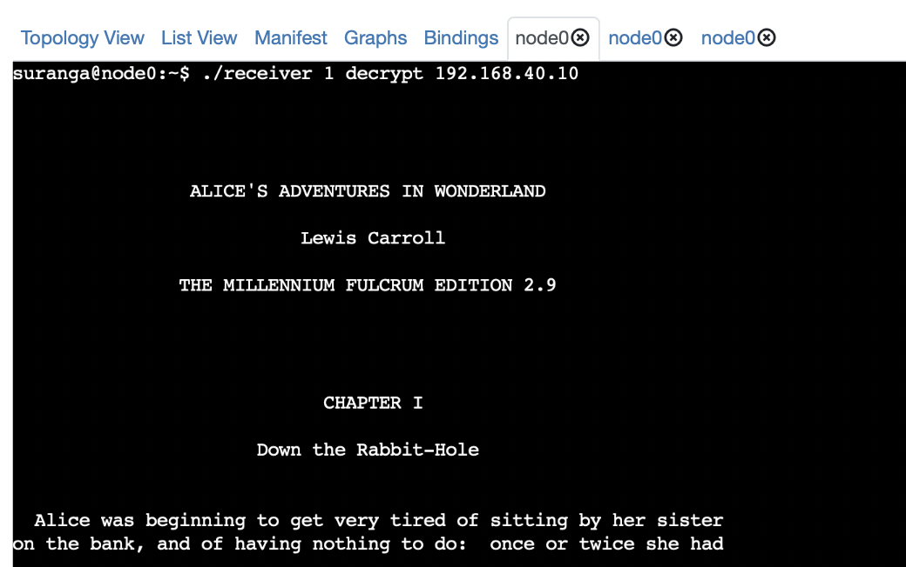

# FPGA to NIC Communication: U280 as Sender and 100 GbE NIC as Receiver

## `udp_receiver.c`: Receiver for FPGA generated UDP packets

This repository has a C program named udp_receiver.c, which functions as a UDP packet receiver. It is meant to receive packets sent from a U280 FPGA serving as the sender, while the host with a 100 GbE NIC serves as the receiver.

## Prerequisites

Make sure you've got the required FPGA bitstream and the sender host executable ready before setting up the experiment. You'll find the UDP sender in the [udp-network-demo](https://github.com/OCT-FPGA/udp-network-demo) repository. Just follow the instructions provided in the repository to generate the necessary bitstream and host executables.


## Instructions for Usage

### Clone the Repository

```bash
git clone https://github.com/OCT-FPGA/udp-receiver-nic
```

### Compiling the Receiver

Install the following dependencies if required.

```bash
libssl-dev
libpcap-dev
```

Then you can run the following command to build the receiver executable.

```bash
make
```

### Deployment

Set up a CloudLab experiment by using the '100g-nic' branch of the 'oct-u280' profile. 


For this experiment, having one node is enough. This is because nodes in this profile come with both an FPGA and a NIC. However, if you want the sender and receiver on different nodes, you should use two nodes when creating the experiment.

First, set up the IP address of the NIC interface:

```bash
sudo ifconfig ens4 192.168.40.10 netmask 255.255.255.0 up
```

Start the receiver program on the receiving node:

```bash
$ ./receiver <number_of_packets> <decrypt|no-decrypt> 
```
Finally, start the sender program on the sending (FPGA) node:

```bash
$ ./udp_host_sender_if0 udp_demo_if0.xclbin <number_of_packets> <encrypt|no-encrypt> <sender IP> <receiver IP> <IP gateway>
```


